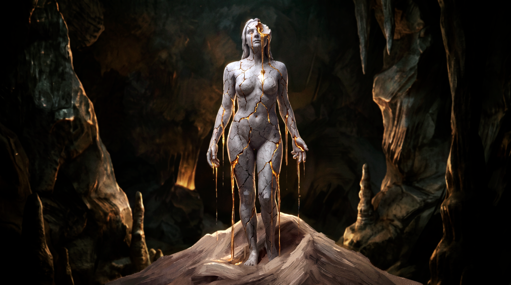

<div style="text-align: center;">

  <pre style="
    display: inline-block;
    text-align: left;
    font-family: 'Courier New', monospace;
    font-size: 14px;
    line-height: 1.4;
    background: #1e1e1e;
    color: #ffb86c;
    padding: 15px 30px;
    border-radius: 10px;
    margin: 10px auto;
  ">

⠀⠀⠀⠀⠀⠀⠀⠀⠀⠀⠀⠀⠀⠀⠀⠀⠀⠀⠀⠀⠀⢀⣤⣀⣀⢀⣠⣶⣶⡂⠀⠀⠀⠀⠀⠀⠀⠀⠀⠀⠀
⠀⠀⠀⠀⠀⠀⠀⠀⠀⠀⠀⠀⠀⠀⠀⠀⠀⠀⢀⣤⣶⣿⣿⣿⣿⣿⣿⢛⢛⠀⠀⠀⠀⠀⠀⠀⠀⠀⠀⠀⠀
⠀⠀⠀⠀⠀⠀⠀⠀⠀⠀⠀⠀⠀⠀⠀⠀⠀⣴⣾⣿⣿⣿⣿⣿⣿⣿⣿⣿⣿⡄⠀⠀⠀⠀⠀⠀⠀⠀⠀⠀⠀
⠀⠀⠀⠀⠀⠀⠀⠀⠀⠀⠀⠀⠀⠀⠀⠀⣸⣿⢿⣿⣿⣿⣿⣿⣿⣿⣿⣿⡿⠁⠀⠀⠀⠀⠀⢀⣀⠀⠀⠀⠀
⠀⠀⠀⠀⠀⠀⠀⠀⠀⠀⠀⠀⠀⠀⠀⠀⣿⣿⡾⣁⣿⣿⣿⣿⣿⣿⣿⡉⠀⠀⠀⠀⠀⠀⠀⠙⢻⢀⠀⠀⠀
⠀⠀⠀⠀⠀⠀⠀⠀⠀⠀⠀⠀⠀⠀⠀⣰⣿⡏⢡⣿⣿⣿⣿⣿⣿⣿⢿⣷⠀⠀⠀⠀⠀⠀⡀⠀⠘⢿⡇⠀⠀
⠀⠀⠀⠀⠀⠀⠀⠀⠀⠀⠀⠀⠀⠀⢀⣿⣿⠇⣼⣿⣿⣟⠉⠉⠉⣿⣿⡏⠀⠀⠀⠀⢀⡜⠇⠀⠀⣈⡁⡘⡿
⠀⠀⠀⠀⠀⠀⠀⠀⠀⠀⠀⠀⠀⠀⢸⣿⣿⠀⣿⣿⢟⠈⠂⠄⠀⣿⣿⡧⠀⠀⢴⣾⡯⠀⠀⠀⠰⣿⠏⣸⡇
⠀⠀⠀⠀⠀⠀⠀⠀⠀⠀⠀⠀⠀⠀⣿⣿⣿⡄⠘⠁⢀⣾⣿⣷⣾⣿⣿⣿⡄⢶⣽⣿⣿⣶⣶⣤⣀⡡⢸⠟⠀
⠀⠀⠀⠀⠀⠀⠀⠀⠀⠀⠀⠀⠀⢠⣿⣿⣿⡇⢸⣿⣿⣿⣿⣿⣿⣿⠛⠋⠀⠈⣇⠹⡉⠘⣠⠉⠟⠈⠁⡀⠀
⠀⠀⠀⠀⠀⠀⠀⠀⠀⠀⠀⠀⠀⠘⣿⡟⣿⡇⢸⣿⣿⣿⣿⣿⣿⣿⢀⡀⠀⠀⠸⢀⣆⠀⡏⠀⠀⠀⠀⡓⠄
⠀⠀⠀⠀⠀⠀⠀⠀⠀⠀⠀⠀⠀⠀⢹⠃⣿⡇⠀⡿⣿⣿⢻⣿⣿⣿⣿⠷⠆⠀⠀⠋⠉⠄⡵⠀⠀⠀⠀⡀⠀
⠀⠀⠀⠀⠀⠀⠀⠀⠀⠀⠀⠀⠀⠀⢻⠀⢸⠀⠀⠀⠹⢿⣿⣿⣿⠟⣀⣤⣤⠤⠀⠀⠀⠡⠇⠀⠀⠀⠀⠁⠀
⠀⠀⠀⠀⠀⠀⠀⠀⠀⠀⠀⠀⠀⠀⣿⣏⠘⠀⠀⠀⢀⠸⣿⣿⣷⣿⠏⠉⠀⠀⠀⠠⠀⠀⡁⠀⠀⠀⠀⠀⠀
⠀⠀⠀⠀⠀⠀⠀⠀⠀⠀⠀⠀⠀⠀⢹⣿⠀⠀⠀⠀⠀⠀⠻⣿⠟⣿⣿⣿⣿⠿⠔⠀⠀⠀⠂⠀⠀⠀⠀⠀⠀
⠀⠀⠀⠀⠀⠀⠀⠀⠀⠀⠀⠀⠀⠠⠈⢿⡇⡆⠀⠀⠀⠀⠀⠀⠈⠙⠛⠛⠁⠀⠀⠀⢴⠀⠀⠀⠀⠀⠀⠀⠀
⠀⠀⠀⠀⠀⠀⠀⠀⠀⠀⠀⠀⠀⠀⠁⠘⡇⣹⠀⠀⠀⠀⠀⠀⠀⠀⠀⠀⠀⠀⠀⠀⢸⡀⠀⠀⠀⠀⠀⠀⠀
⠀⠀⠀⠀⠀⠀⠀⠀⠀⠀⠀⠀⠀⣄⠀⠀⢹⣿⡆⠀⠀⠀⠀⡆⠀⠀⠀⠀⠀⠀⠀⠀⢘⡆⠀⠀⠀⠀⠀⠀⠀
⠀⠀⠀⠀⠀⠀⠀⠀⠀⠀⠀⠀⢀⣿⡆⠀⣧⣿⡇⠀⠀⠀⠀⣧⠀⠀⠀⠀⠀⠀⠀⠀⠸⡆⠀⠀⠀⠀⠀⠀⠀
⠀⠀⠀⠀⠀⠀⠀⠀⠀⠀⠀⠀⢸⣿⡁⠀⣻⣿⡇⠀⠀⠀⠀⣿⡇⠀⠀⠀⠀⠀⠀⠀⠀⠇⠀⠀⠀⠀⠀⠀⠀
⠀⠀⠀⠀⠀⠀⠀⠀⠀⠀⠀⢠⡿⣿⠇⠀⣿⣿⠇⠀⠀⠀⠀⢸⣿⣳⡀⠀⠀⠀⠀⠀⠀⠃⠀⠀⠀⠀⠀⠀⠀
⠀⠀⠀⠀⠀⠀⠀⠀⠀⠀⣴⠟⣴⡇⠀⣸⣿⡁⠀⠀⠀⠀⠀⠈⠿⢻⣇⠀⠀⠀⠀⠀⠈⢀⠀⠀⠀⠀⠀⠀⠀
⠀⠀⠀⠀⠀⠀⠀⠀⠀⣔⣧⡼⠟⠁⣴⣿⣿⠃⠀⠀⠀⠀⠀⠀⠰⣼⣿⡀⠀⠀⠀⠀⠀⠀⠄⠀⠀⠀⠀⠀⠀
⠀⠀⠀⠀⠀⠀⠀⢀⣠⣮⣬⣵⣶⣾⣿⣿⠃⠀⠀⠀⠀⠀⠀⠀⣴⣿⣼⣿⡄⠀⠀⠀⠀⠀⠀⠀⠀⠀⠀⠀⠀
⠀⠀⠀⠀⢀⣤⣶⣿⣿⣿⣿⣿⣿⣿⣿⡏⠀⠀⠀⠀⢻⣿⣶⣶⣿⣷⣿⣿⣷⣤⣴⣇⠀⠐⠀⠀⠀⠀⠀⠀⠀
⠀⠀⠀⢀⣾⣿⣿⣿⣿⣿⣿⣿⣿⣿⣿⡇⠀⠀⠀⠀⠈⠛⠹⢟⣹⣿⣿⣿⣿⣿⣿⣿⠦⠀⠀⠀⠀⠀⠀⠀⠀
⠀⠀⠀⣾⣿⣿⣿⣿⣿⣿⣿⣿⣿⡿⣿⠀⠀⠀⠀⠀⠀⢀⣠⣾⣿⣿⣿⣿⣿⣯⣿⡿⠀⠀⠀⠀⠀⠀⠀⠀⠀
⠀⠀⣸⠋⠷⠻⢿⣿⣿⠟⢩⣿⡟⡇⢹⣀⢸⣧⠀⠀⢡⣾⣿⣾⣟⢿⣿⡿⠽⠿⠟⠁⠀⠀⠀⠀⠀⠀⠀⠀⠀
⠀⠀⠁⠀⠈⠀⠊⠁⠀⠀⠈⢻⣧⠀⠀⠙⢦⣽⣇⠈⣿⣿⣿⣿⣿⢢⠀⠀⠀⠀⠀⠀⠀⠀⠀⠀⠀⠀⠀⠀⠀
⠀⠀⠀⠀⠀⠀⠀⠀⠀⠀⠀⠘⣿⢀⠀⠀⠀⠙⠉⠀⠸⠿⠿⠍⠋⠀⠀⠀⠀⠀⠀⠀⠀⠀⠀⠀⠀⠀⠀⠀⠀
⠀⠀⠀⠀⠀⠀⠀⠀⠀⠀⠀⠀⠀⠟⠁⠀⠀⠀⠀⠀⠀⠁⠀⠀⠀⠀⠀⠀⠀⠀⠀⠀⠀⠀⠀⠂⠀⠀⠀⠀⠀
</div>

# Decadence — Omarchy Theme

Dark theme with golden accents and marble white, designed for [Omarchy](https://omarchy.org/).

<div align="center">

[](https://github.com/InVaeR/decadence-omarchy-theme/releases)
[](https://omarchy.org/)
[](https://hyprland.org)
[](LICENSE)

</div>

<div align="center">
  <a href="preview.png"></a>
  <a href="preview-unlock.png"></a>
</div>

## Installation

### One-liner (recommended)

```bash
omarchy theme install https://github.com/InVaeR/decadence-omarchy-theme.git
```

### Manual

```bash
git clone https://github.com/InVaeR/decadence-omarchy-theme.git \
  ~/.config/omarchy/themes/decadence
omarchy theme set decadence
```

### Reload

After switching, the theme applies automatically. To force a reload:

```bash
omarchy theme reload
```

## Palette

<table>
  <thead>
    <tr>
      <th>Role</th>
      <th>Hex</th>
      <th>Swatch</th>
    </tr>
  </thead>
  <tbody>
    <tr>
      <td><strong>Background</strong></td>
      <td><code>#0d0d0d</code></td>
      <td></td>
    </tr>
    <tr>
      <td><strong>Foreground</strong></td>
      <td><code>#e8e4df</code></td>
      <td></td>
    </tr>
    <tr>
      <td><strong>Accent</strong></td>
      <td><code>#d4a843</code></td>
      <td></td>
    </tr>
    <tr>
      <td><strong>Success</strong></td>
      <td><code>#5a9e6f</code></td>
      <td></td>
    </tr>
    <tr>
      <td><strong>Warning</strong></td>
      <td><code>#d4a843</code></td>
      <td></td>
    </tr>
    <tr>
      <td><strong>Error</strong></td>
      <td><code>#c45c5c</code></td>
      <td></td>
    </tr>
    <tr>
      <td><strong>Info</strong></td>
      <td><code>#5a8eb8</code></td>
      <td></td>
    </tr>
  </tbody>
</table>

## Terminal colors

<details>
<summary>Show terminal palette</summary>

| Color   | Hex       | Bright          | Hex       |
| ------- | --------- | --------------- | --------- |
| Red     | `#c45c5c` | Bright Red      | `#e87171` |
| Yellow  | `#d4a843` | Bright Yellow   | `#e8c05a` |
| Orange  | `#c9973e` |                 |           |
| Green   | `#5a9e6f` | Bright Green    | `#6fb889` |
| Cyan    | `#5a8eb8` | Bright Cyan     | `#7ba5c8` |
| Blue    | `#5a8eb8` | Bright Blue     | `#7ba5c8` |
| Magenta | `#8a6d2b` | Bright Magenta  | `#b8922f` |
| Brown   | `#6b6560` |                 |           |

</details>

## Files

```
decadence-omarchy-theme/
├── backgrounds/          # 9 wallpapers, 5504×3072
├── colors.toml           # Omarchy color definitions
├── palette.json          # Extended palette & semantic tokens
├── preview.png           # Desktop preview
├── preview-unlock.png    # Lock screen preview
└── unlock.png            # Lock screen background
```

## Wallpapers

Nine original marble-and-gold wallpapers (5504×3072) are included in
[`backgrounds/`](backgrounds/).

<details>
<summary>Gallery</summary>

| | | |
| --- | --- | --- |
|  |  |  |
|  |  |  |
|  |  |  |

</details>

## License

MIT — see [LICENSE](LICENSE).
